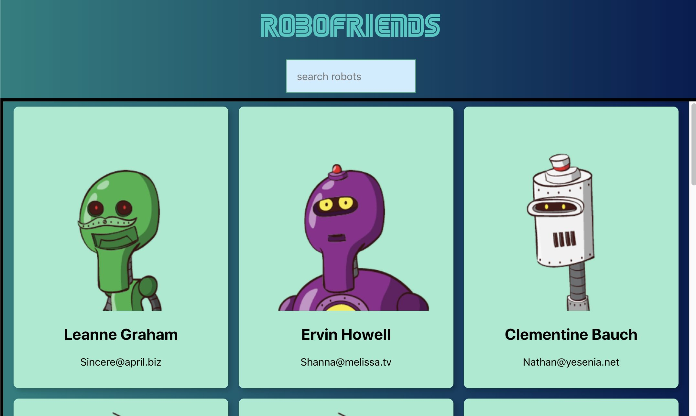

# React robofriends

## Description

Generate unique image of robot/alien/monster according registered name and fetch with redux action

**_DEMO:_**



## Usage / Install

Clone repo, cd into folder and run:

```console
$ npm install
$ npm start
```

## Requirement

- npm

## Tools

- Create-react-app cli
- Tachyons: CSS framework
- Robohash API
- JSONPlaceholder: Fetch the robots data
- Redux, React-redux, Redux-logger
- Redux-thunk: handle asynchronous action in redux (returns function instead of object in action)

## Licence

[MIT](./LICENSE.txt)

## Author

[Shoe Kure](https://github.com/roy1210)